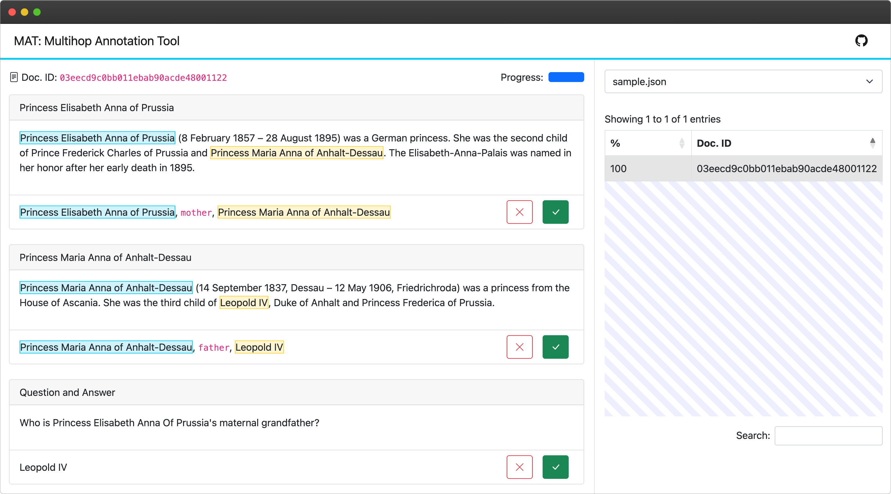

# MAT

MAT: Multihop Annotation Tool



## Installation

```sh
conda create -n multihop-annotation-tool python=3.10

conda activate multihop-annotation-tool

pip install -r requirements.txt

git lfs install

git clone https://huggingface.co/sentence-transformers/all-MiniLM-L6-v2 models/all-MiniLM-L6-v2
```

## Usage

```sh
./run.sh
```

Access via http://127.0.0.1:8000

## License

[MIT](https://choosealicense.com/licenses/mit/)
